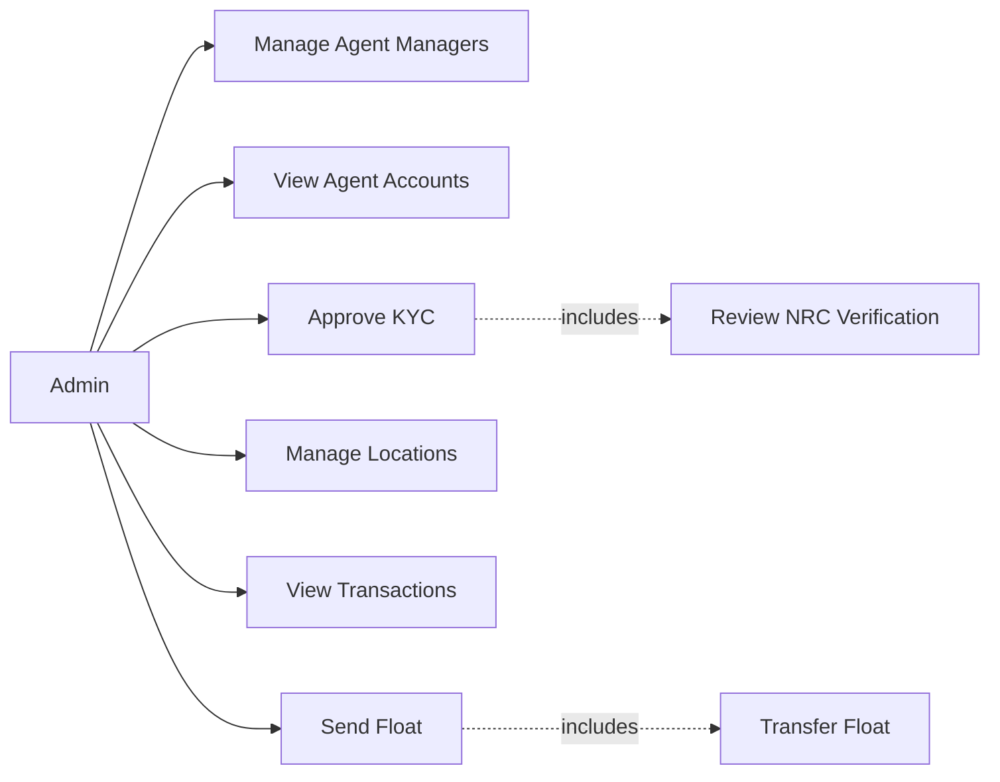
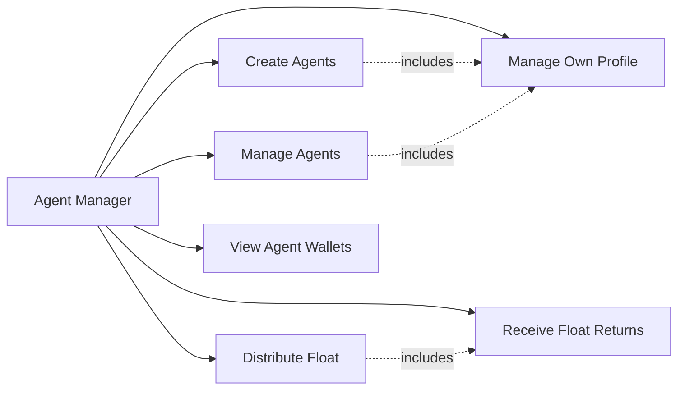
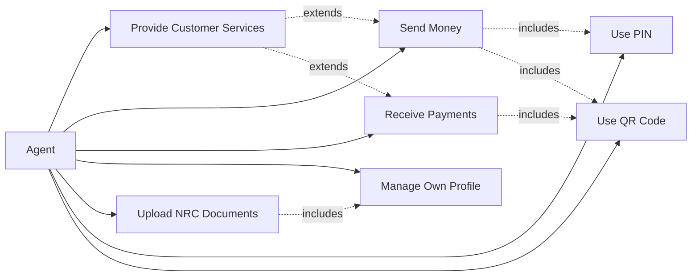
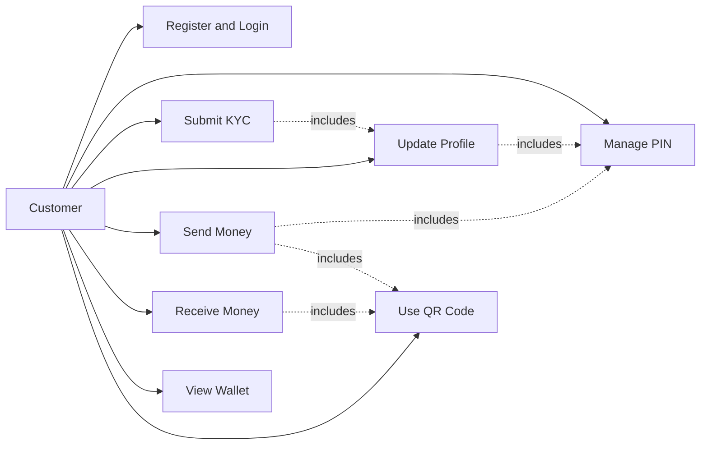

# Digital Wallet Management System Specification & Architecture

## Executive Summary

This document describes the Digital Wallet Management System architecture, workflows, user roles, security rules, and business policies. It is intended for developers, QA testers, product managers, and system administrators.

## Use Case Diagram

### Admin Use Case Diagram



### Agent Manager Use Case Diagram



### Agent Use Case Diagram



### Customer Use Case Diagram



# 1. Overall System Architecture

The Digital Wallet Management System uses a hierarchical wallet architecture with four primary roles.


```text
Admin
   │
   ▼
Agent Manager
   │
   ▼
Agent
   │
   ▼
Customer
```

Float is distributed from higher roles to lower roles, while float returns flow from lower roles back upward. Customers can also perform peer-to-peer transfers among themselves.

# 2. Core Workflows

## Authentication

- Users authenticate with phone number and OTP.
- After OTP verification, users set a secure 4-digit PIN.
- Successful authentication issues a Laravel Sanctum bearer token.

## Float Distribution

Admin → Agent Manager → Agent

## Customer Services

Agents provide the following customer services:

- Cash In
- Cash Out
- QR Payment

## Customer Transfers

Customers can transfer money using:

- Phone number
- Wallet number
- QR code

## KYC Verification

Customers can submit NRC front and back images for verification.

The verification process moves through:

- Pending
- Verified
- Rejected

Admin reviews and updates customer KYC status.

# 3. User Roles

## Admin

### Main Features

- Create, edit, and remove Agent Manager accounts.
- View Agent accounts.
- View Agent Manager, Agent, and Customer accounts.
- View wallet balance and wallet status for other users.
- Review customer KYC requests and approve or reject them.
- Review and update NRC verification status for users.
- Manage state regions and townships.
- View system transactions and wallet activity.
- Send money to Agent Managers.
- Turn user status, wallet status, and verification status on or off.
- Search users by name, phone number, NRC number, code, status, region, or township.
- View own profile and account information.

## Agent Manager

### Main Features

- Create new Agent accounts and assign each one an agent code.
- Edit agent profile details such as name, shop name, address, region, township, and NRC images.
- Manage the Agents created by this manager.
- Search Agents by name, phone number, code, status, region, or township.
- Send money to Agents.
- Receive money from Agents and send money back to Admin when needed.
- View Agent wallet balances and transaction history.
- Upload or update agent-related NRC documents.
- Use OTP and PIN to access the system safely.
- View own profile and account information.

## Agent

### Main Features

- Register and log in with phone number and OTP.
- Create, change, and reset a PIN.
- Provide Cash In, Cash Out, and QR Payment services to customers.
- Send money to Customers and Agent Managers.
- Receive money from Customers and other Agents by phone, wallet number, or QR code.
- View wallet balance and transaction history.
- Upload or update NRC documents.
- View or update own NRC verification status.
- Use PIN to confirm money transfers.
- View own profile and account details.
- Create and use a QR code for receiving payments.

## Customer

### Main Features

- Register and log in with phone number and OTP.
- Create, change, and reset a 4-digit PIN.
- Submit NRC front and back images for KYC.
- Update profile details and profile photo.
- Create and use a personal QR code to receive money.
- Send money to other Customers and Agents.
- Receive money from Customers and Agents.
- View wallet balance, receipts, and transaction history.
- Use PIN to confirm transfers.
- View own wallet and profile information.
- View their own KYC status and account status.

# 4. Money Transfer Rules


| Sender        | Receiver      | Allowed |
| ------------- | ------------- | ------- |
| Admin         | Agent Manager | ✅      |
| Agent Manager | Agent         | ✅      |
| Agent Manager | Admin         | ✅      |
| Agent         | Customer      | ✅      |
| Agent         | Agent Manager | ✅      |
| Customer      | Customer      | ✅      |
| Customer      | Agent         | ✅      |

## Disallowed Transfers

- Admin ↔ Customer
- Admin ↔ Agent
- Agent Manager ↔ Customer

# 5. Security Rules

- Both sender and receiver accounts must be active.
- Wallets must be active to process transfers.
- All transactions require PIN verification.
- PINs are stored securely using bcrypt hashing.
- NRC number and user role cannot be changed after account creation.
- Profile and NRC images must be uploaded as multipart/form-data.

# 6. Notifications

When money is received, the system provides:

- Notification records
- Badge count updates
- Sound alerts
- Real-time toast messages

# 7. Transaction Receipt

Each transaction automatically generates:

- A unique transaction number
- A receipt
- A history record

# 8. Summary

The system is built around:

- Hierarchical wallet architecture
- Secure authentication
- Float management
- Customer wallet services
- QR payments
- Cash In / Cash Out operations
- KYC verification
- Transaction receipts and history
- Real-time notifications

This design prioritizes role separation, security, and usability.
