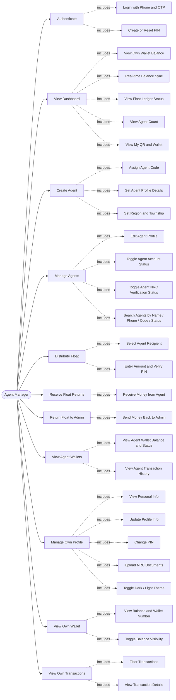
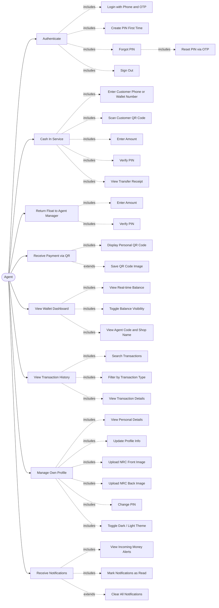
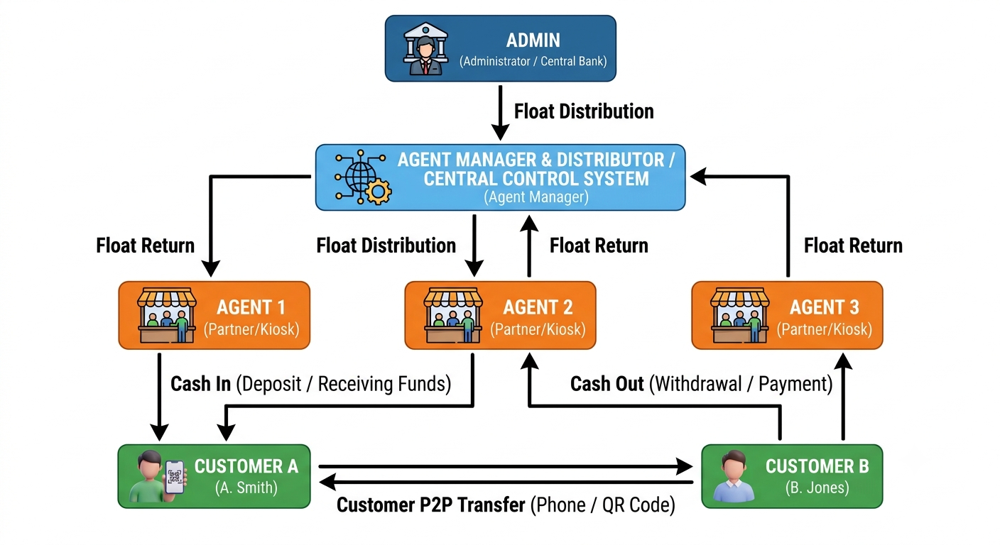
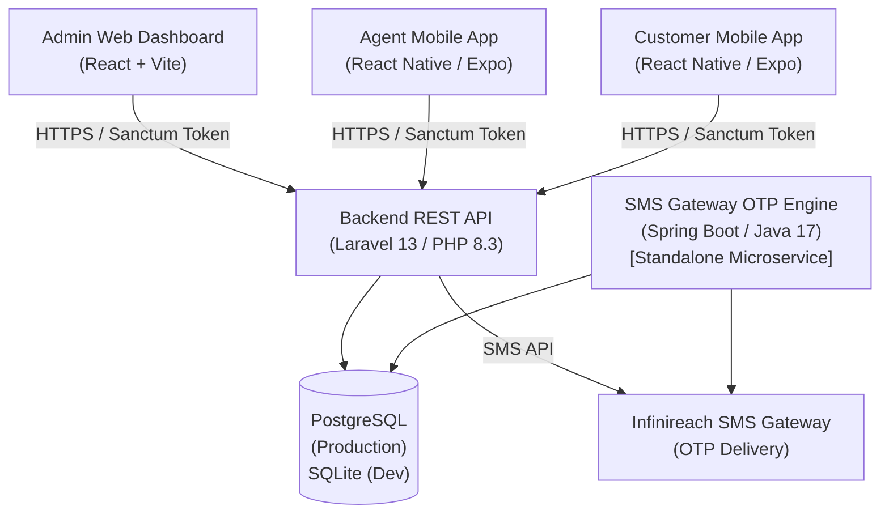
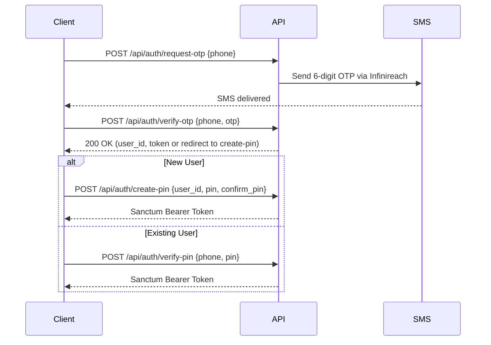
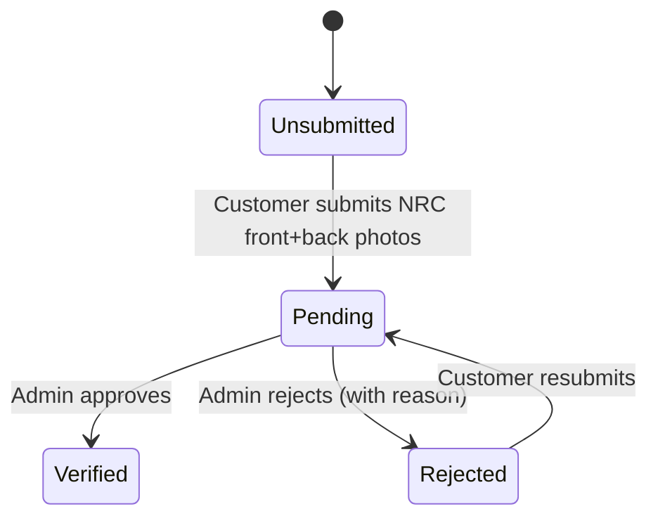

# Digital Wallet Management System — Specification & Architecture

## Executive Summary

This document describes the complete Digital Wallet Management System (DWMS) architecture, technology stack, workflows, API surface, database schema, user roles, security rules, and business policies. It is intended for developers, QA testers, product managers, and system administrators.

The system is composed of five sub-projects:


| Component                            | Type                  | Technology                |
| ------------------------------------ | --------------------- | ------------------------- |
| `digital-wallet-backend-api`         | REST API              | Laravel 13 / PHP 8.3      |
| `digital-wallet-customer-mobile-app` | Mobile App (Customer) | React Native / Expo 57    |
| `digital-wallet-agent-mobile-app`    | Mobile App (Agent)    | React Native / Expo 57    |
| `digital-wallet-frontend-admin`      | Web Admin Dashboard   | React 19 + Vite 8         |
| `sms-gateway-otp-engine`             | OTP Microservice      | Spring Boot 3.2 / Java 17 |

---

## Use Case Diagrams

### Admin Use Case Diagram

```mermaid
flowchart LR
    Admin([Admin])

    UC0[Authenticate]
    UC0a[Login with Phone and OTP]
    UC0b[Create or Reset PIN]

    UC1[View Dashboard]
    UC1a[View Treasury Wallet Balance]
    UC1b[Real-time Balance Sync]
    UC1c[View System Engine Status]

    UC2[Manage Agent Managers]
    UC2a[Create Agent Manager]
    UC2b[Edit Agent Manager]
    UC2c[Delete Agent Manager]
    UC2d[Toggle Account Status]
    UC2e[View Agent Manager Wallet]

    UC3[View Agents]
    UC3a[Search Agents by Name / Phone / Code]
    UC3b[Toggle Agent Account Status]
    UC3c[Toggle Agent NRC Status]

    UC4[Manage Customers]
    UC4a[View Customer List]
    UC4b[Toggle Customer Account Status]
    UC4c[Approve KYC]
    UC4d[Reject KYC with Reason]
    UC4e[Toggle Customer KYC Status]

    UC5[Review NRC Verifications]
    UC5a[View Pending NRC Documents]
    UC5b[Verify NRC]
    UC5c[Reject NRC]

    UC6[Manage Locations]
    UC6a[Create / Edit / Delete State Regions]
    UC6b[Create / Edit / Delete Townships]

    UC7[View System Transactions]
    UC7a[Filter Transactions]
    UC7b[View Transaction Details]

    UC8[Send Float to Agent Manager]
    UC8a[Select Agent Manager]
    UC8b[Enter Amount and PIN]

    UC9[Manage All Wallets]
    UC9a[View All Wallet Balances]
    UC9b[Toggle Wallet Status]

    UC10[View System Wallet]
    UC10a[View Treasury Reserve]
    UC10b[View Wallet Number and Status]

    UC11[Manage Own Profile]
    UC11a[View Account Info]
    UC11b[Toggle Dark / Light Theme]

    Admin --> UC0
    Admin --> UC1
    Admin --> UC2
    Admin --> UC3
    Admin --> UC4
    Admin --> UC5
    Admin --> UC6
    Admin --> UC7
    Admin --> UC8
    Admin --> UC9
    Admin --> UC10
    Admin --> UC11

    UC0 -. includes .-> UC0a
    UC0 -. includes .-> UC0b
    UC1 -. includes .-> UC1a
    UC1 -. includes .-> UC1b
    UC1 -. includes .-> UC1c
    UC2 -. includes .-> UC2a
    UC2 -. includes .-> UC2b
    UC2 -. includes .-> UC2c
    UC2 -. includes .-> UC2d
    UC2 -. includes .-> UC2e
    UC3 -. includes .-> UC3a
    UC3 -. includes .-> UC3b
    UC3 -. includes .-> UC3c
    UC4 -. includes .-> UC4a
    UC4 -. includes .-> UC4b
    UC4 -. includes .-> UC4c
    UC4 -. includes .-> UC4d
    UC4 -. includes .-> UC4e
    UC5 -. includes .-> UC5a
    UC5 -. includes .-> UC5b
    UC5 -. includes .-> UC5c
    UC6 -. includes .-> UC6a
    UC6 -. includes .-> UC6b
    UC7 -. includes .-> UC7a
    UC7 -. includes .-> UC7b
    UC8 -. includes .-> UC8a
    UC8 -. includes .-> UC8b
    UC9 -. includes .-> UC9a
    UC9 -. includes .-> UC9b
    UC10 -. includes .-> UC10a
    UC10 -. includes .-> UC10b
    UC11 -. includes .-> UC11a
    UC11 -. includes .-> UC11b
```



### Agent Manager Use Case Diagram



### Agent Use Case Diagram



### Customer Use Case Diagram

```mermaid
flowchart LR
    Customer([Customer])

    UC1[Authenticate]
    UC1a[Login with Phone and OTP]
    UC1b[Create PIN First Time]
    UC1c[Forgot PIN]
    UC1d[Reset PIN via OTP]
    UC1e[Sign Out]

    UC2[Manage PIN]
    UC2a[Change PIN]
    UC2b[Enter Current PIN]
    UC2c[Confirm New PIN]

    UC3[Submit KYC Verification]
    UC3a[Upload NRC Front Image]
    UC3b[Upload NRC Back Image]
    UC3c[View KYC Status Pending / Verified / Rejected]
    UC3d[View Rejection Reason]
    UC3e[Resubmit After Rejection]

    UC4[Manage Profile]
    UC4a[View Personal Info Card]
    UC4b[Update Full Name]
    UC4c[Upload or Change Profile Photo]
    UC4d[Toggle Dark / Light Theme]
    UC4e[Switch Language EN / MY]
    UC4f[Toggle Auto-Save Receipt]

    UC5[Send Money]
    UC5a[Enter Recipient Phone Number]
    UC5b[Enter Recipient Wallet Number]
    UC5c[Scan Recipient QR Code via Camera]
    UC5d[Enter Transfer Amount]
    UC5e[Enter Optional Note]
    UC5f[Verify 4-Digit PIN]
    UC5g[View Transfer Receipt]
    UC5h[Save Receipt Image to Gallery]
    UC5i[Share Receipt via System Share]

    UC6[Receive Money]
    UC6a[Display Personal QR Code]
    UC6b[Save QR Code Image]
    UC6c[Share QR Code]

    UC7[View Wallet Dashboard]
    UC7a[View Real-time Wallet Balance]
    UC7b[Toggle Balance Visibility]
    UC7c[View Wallet Number and Status]
    UC7d[View KYC Status Badge]
    UC7e[View KYC Rejection Banner]

    UC8[View Transaction History]
    UC8a[Search by Transaction Number / Phone / Name]
    UC8b[Filter by Type - All / Received / Sent / P2P]
    UC8c[View Individual Transaction Details]

    UC9[Receive Notifications]
    UC9a[View Incoming Money Toast Alert]
    UC9b[View Notification Centre]
    UC9c[Mark All Notifications as Read]
    UC9d[Clear All Notifications]

    Customer --> UC1
    Customer --> UC2
    Customer --> UC3
    Customer --> UC4
    Customer --> UC5
    Customer --> UC6
    Customer --> UC7
    Customer --> UC8
    Customer --> UC9

    UC1 -. includes .-> UC1a
    UC1 -. includes .-> UC1b
    UC1 -. includes .-> UC1c
    UC1c -. includes .-> UC1d
    UC1 -. includes .-> UC1e
    UC2 -. includes .-> UC2a
    UC2a -. includes .-> UC2b
    UC2a -. includes .-> UC2c
    UC3 -. includes .-> UC3a
    UC3 -. includes .-> UC3b
    UC3 -. includes .-> UC3c
    UC3c -. extends .-> UC3d
    UC3c -. extends .-> UC3e
    UC4 -. includes .-> UC4a
    UC4 -. includes .-> UC4b
    UC4 -. includes .-> UC4c
    UC4 -. includes .-> UC4d
    UC4 -. includes .-> UC4e
    UC4 -. includes .-> UC4f
    UC5 -. includes .-> UC5a
    UC5 -. includes .-> UC5b
    UC5 -. includes .-> UC5c
    UC5 -. includes .-> UC5d
    UC5 -. includes .-> UC5e
    UC5 -. includes .-> UC5f
    UC5 -. includes .-> UC5g
    UC5g -. extends .-> UC5h
    UC5g -. extends .-> UC5i
    UC6 -. includes .-> UC6a
    UC6 -. extends .-> UC6b
    UC6 -. extends .-> UC6c
    UC7 -. includes .-> UC7a
    UC7 -. includes .-> UC7b
    UC7 -. includes .-> UC7c
    UC7 -. includes .-> UC7d
    UC7d -. extends .-> UC7e
    UC8 -. includes .-> UC8a
    UC8 -. includes .-> UC8b
    UC8 -. includes .-> UC8c
    UC9 -. includes .-> UC9a
    UC9 -. includes .-> UC9b
    UC9b -. includes .-> UC9c
    UC9b -. extends .-> UC9d
```



---

# 1. Overall System Architecture

The Digital Wallet Management System uses a hierarchical wallet architecture with four primary user roles.



```text
Admin (Web Dashboard)
   │
   ▼
Agent Manager (Web Dashboard)
   │
   ▼
Agent (Mobile App)
   │
   ▼
Customer (Mobile App)
```

Float is distributed top-down (Admin → Agent Manager → Agent), while float returns flow bottom-up. Customers can also perform peer-to-peer (P2P) transfers among themselves and to/from Agents.

### System Communication Diagram



---

# 2. Technology Stack

## 2.1 Backend API — `digital-wallet-backend-api`


| Item             | Detail                                            |
| ---------------- | ------------------------------------------------- |
| Framework        | Laravel 13.8                                      |
| Language         | PHP 8.3                                           |
| Authentication   | Laravel Sanctum 4.3 (Bearer Token)                |
| Database (Dev)   | SQLite                                            |
| Database (Prod)  | PostgreSQL (via`DATABASE_URL`)                    |
| Queue            | Database queue driver                             |
| Cache            | Database cache driver                             |
| Session          | Database session driver                           |
| Password Hashing | bcrypt (12 rounds)                                |
| SMS Integration  | Infinireach SMS API                               |
| Deployment       | Render.com (Docker)                               |
| API URL          | `https://digital-wallet-backend-api.onrender.com` |

**Key PHP Packages:**


| Package             | Version | Purpose                  |
| ------------------- | ------- | ------------------------ |
| `laravel/framework` | ^13.8   | Core framework           |
| `laravel/sanctum`   | ^4.3    | API token authentication |
| `laravel/tinker`    | ^3.0    | REPL for development     |

## 2.2 Customer Mobile App — `digital-wallet-customer-mobile-app`


| Item            | Detail                                                  |
| --------------- | ------------------------------------------------------- |
| Framework       | Expo 57 + React Native 0.86                             |
| Language        | TypeScript                                              |
| React Version   | 19.2.3                                                  |
| Styling         | NativeWind 4 (TailwindCSS for React Native)             |
| Navigation      | Expo Router 57 (file-based)                             |
| Storage         | expo-secure-store (token), AsyncStorage (notifications) |
| Android Package | `com.kxunsithu.digitalwalletcustomer`                   |
| EAS Project ID  | `3144640a-9629-4f3b-9d39-4648ebb18f65`                  |

**Key Libraries:**


| Library                       | Purpose                      |
| ----------------------------- | ---------------------------- |
| `expo-camera`                 | QR code scanning             |
| `expo-image-picker`           | Profile & NRC photo uploads  |
| `react-native-qrcode-svg`     | Personal QR code display     |
| `expo-print` + `expo-sharing` | Receipt generation & sharing |
| `expo-media-library`          | Save receipts to gallery     |
| `expo-linear-gradient`        | Wallet card gradient UI      |
| `react-native-toast-message`  | In-app toast notifications   |
| `react-native-reanimated`     | Smooth animations            |
| `expo-glass-effect`           | Glassmorphism UI effects     |

## 2.3 Agent Mobile App — `digital-wallet-agent-mobile-app`


| Item            | Detail                                                    |
| --------------- | --------------------------------------------------------- |
| Framework       | Expo 57 + React Native 0.86                               |
| Language        | TypeScript                                                |
| React Version   | 19.2.3                                                    |
| Styling         | NativeWind 4 (TailwindCSS for React Native)               |
| Navigation      | Expo Router 57 (file-based)                               |
| Storage         | expo-secure-store (token)                                 |
| OTA Updates     | expo-updates 57                                           |
| Android Package | `com.kxunsithu.digitalwalletagent`                        |
| EAS Project ID  | `aeb0c9b8-ada5-457d-a8e0-5df4ffecd66e`                    |
| EAS Updates URL | `https://u.expo.dev/aedc38c0-5b53-4c1c-89cf-fbace89975f5` |

The Agent app shares the same core library set as the Customer app, plus `expo-blur` and `expo-updates` for OTA deployments.

## 2.4 Admin Web Dashboard — `digital-wallet-frontend-admin`


| Item             | Detail                              |
| ---------------- | ----------------------------------- |
| Framework        | React 19 + Vite 8                   |
| Language         | TypeScript                          |
| Styling          | TailwindCSS 4 + shadcn/ui + Base UI |
| HTTP Client      | Axios                               |
| Routing          | react-router-dom v7                 |
| State Management | Zustand (store/)                    |
| Charts           | Recharts                            |
| QR Scanning      | @yudiel/react-qr-scanner            |
| QR Display       | react-qr-code                       |
| Icons            | lucide-react                        |
| Toasts           | Sonner                              |
| Theme            | next-themes (dark/light)            |
| Date Utilities   | date-fns                            |
| Deployment       | Vercel                              |

## 2.5 SMS Gateway OTP Engine — `sms-gateway-otp-engine`


| Item         | Detail                  |
| ------------ | ----------------------- |
| Framework    | Spring Boot 3.2.0       |
| Language     | Java 17                 |
| Build Tool   | Maven                   |
| Database     | PostgreSQL              |
| SMS Provider | Infinireach SMS Gateway |
| OTP Length   | 6 digits                |
| OTP Expiry   | 5 minutes               |
| Port         | 8080                    |

---

# 3. Core Workflows

## 3.1 Authentication Flow

All users (Customer, Agent, Agent Manager, Admin) authenticate using the same OTP + PIN flow:



**Auth Screens (Customer & Agent Mobile Apps):**


| Screen     | File                  | Description                            |
| ---------- | --------------------- | -------------------------------------- |
| Login      | `auth/index.tsx`      | Phone number entry                     |
| OTP Verify | `auth/verify-otp.tsx` | 6-digit OTP entry with countdown timer |
| Create PIN | `auth/create-pin.tsx` | First-time 4-digit PIN setup           |
| Verify PIN | `auth/verify-pin.tsx` | Returning user PIN login               |
| Forgot PIN | `auth/forgot-pin.tsx` | PIN reset via OTP                      |
| Reset PIN  | `auth/reset-pin.tsx`  | New PIN after OTP verification         |

**Security details:**

- OTPs expire in 5 minutes; maximum resend attempts are enforced.
- PINs are exactly 4 digits and stored as bcrypt hashes (12 rounds).
- Successful login issues a Laravel Sanctum Bearer token stored in `expo-secure-store`.
- Admin and Agent Manager roles are restricted from the mobile apps; attempting to log in as these roles on the Customer app displays a conflict error.
- The Agent app enforces a role guard on every dashboard poll — non-Agent accounts are immediately signed out.

## 3.2 Float Distribution

```text
Admin
  └──[adminTransfer]──► Agent Manager wallet
                             └──[managerTransfer]──► Agent wallet
                                                         └──[agentTransfer]──► Customer wallet
```

- **Admin → Agent Manager**: `POST /api/transfers/admin`
- **Agent Manager → Agent**: `POST /api/transfers/manager`
- **Agent → Customer (Cash In)**: `POST /api/transfers/agent`
- **Agent Manager ← Agent (Float Return)**: `POST /api/transfers/manager` (reverse direction)

## 3.3 Customer Money Transfer

Customers send money using:

- **Phone Number** — enter recipient phone
- **Wallet Number** — enter recipient wallet number
- **QR Code** — scan recipient's personal QR code with camera

All customer transfers go through `POST /api/transfers/customer`, authenticated by Sanctum, and gated behind PIN verification in the UI before the request is sent.

## 3.4 Agent Cash In / Cash Out


| Service      | Description                          | API                                                    |
| ------------ | ------------------------------------ | ------------------------------------------------------ |
| Cash In      | Agent sends money TO a customer      | `POST /api/transfers/agent` (`agent_to_customer`)      |
| Return Float | Agent returns float to Agent Manager | `POST /api/transfers/agent` (`agent_to_agent_manager`) |
| QR Payment   | Customer pays Agent via QR scan      | `POST /api/transfers/customer` (`customer_to_agent`)   |

**Agent App Quick Actions:**

- **Cash In** → `cash-in.tsx` (send to customer)
- **Return Float** → `cash-out.tsx` (return to manager)
- **My QR** → `qr-code.tsx` (display agent's QR)
- **Scan QR** → opens camera to scan customer/recipient QR

## 3.5 KYC Verification Flow



- Customers upload NRC front and back images via `POST /api/customer/nrc-verifications/submit` (multipart/form-data).
- Admin reviews pending requests at `GET /api/admin/nrc-verifications`.
- Admin approves via `POST /api/admin/nrc-verifications/{id}/verify`.
- Admin rejects via `POST /api/admin/nrc-verifications/{id}/reject`.
- Rejected customers see an inline banner with the rejection reason and a "Resubmit" option in the Customer app.

## 3.6 Real-Time Balance Polling

Both mobile apps poll the `/api/profile` endpoint every **3 seconds** on the dashboard. When an incoming transfer is detected (wallet balance increases between polls), the app:

1. Shows a **toast notification** ("Money Received! +X MMK").
2. Saves a notification record to the local **notification store** (AsyncStorage).
3. Displays a **badge count** on the bell icon in the header.

---

# 4. API Reference

**Base URL (Production):** `https://digital-wallet-backend-api.onrender.com/api`

**Authentication:** `Authorization: Bearer <sanctum_token>` (where required)

## 4.1 Authentication


| Method | Endpoint            | Auth | Description                               |
| ------ | ------------------- | ---- | ----------------------------------------- |
| POST   | `/auth/request-otp` | —   | Send OTP to phone number                  |
| POST   | `/auth/verify-otp`  | —   | Verify OTP code                           |
| POST   | `/auth/create-pin`  | —   | Create 4-digit PIN (new user)             |
| POST   | `/auth/verify-pin`  | —   | Verify PIN and get token (returning user) |
| POST   | `/auth/logout`      | ✅   | Revoke current Sanctum token              |
| POST   | `/auth/resend-otp`  | —   | Resend OTP to phone number                |
| POST   | `/auth/forgot-pin`  | —   | Request PIN reset OTP                     |
| POST   | `/auth/reset-pin`   | —   | Reset PIN using OTP                       |

## 4.2 Profile


| Method | Endpoint                          | Auth | Description                                |
| ------ | --------------------------------- | ---- | ------------------------------------------ |
| GET    | `/profile`                        | ✅   | Get authenticated user's profile           |
| PUT    | `/profile`                        | ✅   | Update profile (name, address, etc.)       |
| POST   | `/profile/upload-profile-picture` | ✅   | Upload profile photo (multipart/form-data) |
| POST   | `/profile/change-pin`             | ✅   | Change 4-digit PIN                         |

## 4.3 Agent Managers


| Method | Endpoint                             | Auth | Middleware     | Description               |
| ------ | ------------------------------------ | ---- | -------------- | ------------------------- |
| GET    | `/agent-managers`                    | ✅   | —             | List all agent managers   |
| POST   | `/agent-managers`                    | ✅   | `ensure.admin` | Create agent manager      |
| GET    | `/agent-managers/{id}`               | ✅   | —             | Get agent manager details |
| PUT    | `/agent-managers/{id}`               | ✅   | `ensure.admin` | Update agent manager      |
| DELETE | `/agent-managers/{id}`               | ✅   | `ensure.admin` | Delete agent manager      |
| POST   | `/agent-managers/{id}/toggle-status` | ✅   | `ensure.admin` | Toggle active/inactive    |

## 4.4 Agents


| Method | Endpoint                         | Auth | Middleware     | Description                    |
| ------ | -------------------------------- | ---- | -------------- | ------------------------------ |
| GET    | `/agents`                        | ✅   | —             | List all agents                |
| POST   | `/agents`                        | ✅   | —             | Create agent                   |
| GET    | `/agents/{id}`                   | ✅   | —             | Get agent details              |
| PUT    | `/agents/{id}`                   | ✅   | —             | Update agent                   |
| DELETE | `/agents/{id}`                   | ✅   | —             | Delete agent                   |
| POST   | `/agents/{id}/toggle-status`     | ✅   | `ensure.admin` | Toggle account status          |
| POST   | `/agents/{id}/toggle-nrc-status` | ✅   | —             | Toggle NRC verification status |

## 4.5 Customers


| Method | Endpoint                            | Auth | Middleware     | Description             |
| ------ | ----------------------------------- | ---- | -------------- | ----------------------- |
| GET    | `/customers`                        | —   | —             | List all customers      |
| GET    | `/customers/{id}`                   | —   | —             | Get customer details    |
| DELETE | `/customers/{id}`                   | ✅   | —             | Delete customer account |
| POST   | `/customers/{id}/toggle-status`     | ✅   | `ensure.admin` | Toggle account status   |
| POST   | `/customers/{id}/toggle-kyc-status` | ✅   | `ensure.admin` | Toggle KYC status       |

## 4.6 Money Transfers


| Method | Endpoint              | Auth | Middleware             | Description                      |
| ------ | --------------------- | ---- | ---------------------- | -------------------------------- |
| POST   | `/transfers/admin`    | ✅   | `ensure.admin`         | Admin → Agent Manager           |
| POST   | `/transfers/manager`  | ✅   | `ensure.agent_manager` | Agent Manager ↔ Agent           |
| POST   | `/transfers/agent`    | ✅   | `ensure.agent`         | Agent → Customer / Float Return |
| POST   | `/transfers/customer` | ✅   | —                     | Customer → Customer/Agent       |

## 4.7 NRC Verifications


| Method | Endpoint                               | Auth | Middleware        | Description                   |
| ------ | -------------------------------------- | ---- | ----------------- | ----------------------------- |
| POST   | `/customer/nrc-verifications/submit`   | ✅   | `ensure.customer` | Submit NRC images             |
| GET    | `/admin/nrc-verifications`             | ✅   | `ensure.admin`    | List all pending KYC requests |
| POST   | `/admin/nrc-verifications/{id}/verify` | ✅   | `ensure.admin`    | Approve KYC                   |
| POST   | `/admin/nrc-verifications/{id}/reject` | ✅   | `ensure.admin`    | Reject KYC                    |

## 4.8 Wallets


| Method | Endpoint                      | Auth | Middleware     | Description                 |
| ------ | ----------------------------- | ---- | -------------- | --------------------------- |
| GET    | `/wallets`                    | —   | —             | List all wallets            |
| GET    | `/wallets/{id}`               | —   | —             | Get wallet details          |
| POST   | `/wallets/{id}/toggle-status` | ✅   | `ensure.admin` | Toggle wallet active/frozen |

## 4.9 QR Codes


| Method | Endpoint           | Auth | Description                           |
| ------ | ------------------ | ---- | ------------------------------------- |
| GET    | `/qr-codes/me`     | ✅   | Get authenticated user's QR code data |
| GET    | `/qr-codes/lookup` | ✅   | Look up a user by QR code value       |

## 4.10 Transactions


| Method | Endpoint             | Auth | Description                                          |
| ------ | -------------------- | ---- | ---------------------------------------------------- |
| GET    | `/transactions`      | ✅   | List transactions (paginated, supports`?per_page=N`) |
| GET    | `/transactions/{id}` | ✅   | Get single transaction with receipt details          |

## 4.11 Locations


| Method | Endpoint                        | Auth     | Description            |
| ------ | ------------------------------- | -------- | ---------------------- |
| GET    | `/locations/state-regions`      | —       | List all state/regions |
| POST   | `/locations/state-regions`      | ✅ Admin | Create state/region    |
| PUT    | `/locations/state-regions/{id}` | ✅ Admin | Update state/region    |
| DELETE | `/locations/state-regions/{id}` | ✅ Admin | Delete state/region    |
| GET    | `/locations/townships`          | —       | List all townships     |
| POST   | `/locations/townships`          | ✅ Admin | Create township        |
| PUT    | `/locations/townships/{id}`     | ✅ Admin | Update township        |
| DELETE | `/locations/townships/{id}`     | ✅ Admin | Delete township        |

---

# 5. Database Schema

## 5.1 Migrations (chronological order)


| Migration File      | Table Created            |
| ------------------- | ------------------------ |
| `0001_01_01_000001` | `cache`                  |
| `0001_01_01_000002` | `jobs`                   |
| `0001_01_01_120000` | `roles`                  |
| `0001_01_01_130000` | `users`                  |
| `2026_07_10_122900` | `state_regions`          |
| `2026_07_10_122900` | `townships`              |
| `2026_07_11_103822` | `personal_access_tokens` |
| `2026_07_11_120002` | `otp_verifications`      |
| `2026_07_11_120003` | `pins`                   |
| `2026_07_11_120006` | `customer_profiles`      |
| `2026_07_11_120007` | `agent_profiles`         |
| `2026_07_11_120008` | `agent_manager_profiles` |
| `2026_07_11_120009` | `wallets`                |
| `2026_07_11_120010` | `qr_codes`               |
| `2026_07_11_120011` | `transactions`           |
| `2026_07_11_120014` | `nrc_verifications`      |
| `2026_07_12_000001` | `images`                 |

## 5.2 Core Models


| Model                 | Table                    | Key Relationships                                    |
| --------------------- | ------------------------ | ---------------------------------------------------- |
| `User`                | `users`                  | hasOne Wallet, hasOne QrCode, belongsTo Role         |
| `Wallet`              | `wallets`                | belongsTo User, hasManyTransactions                  |
| `Transaction`         | `transactions`           | belongsTo sender Wallet, belongsTo receiver Wallet   |
| `QrCode`              | `qr_codes`               | belongsTo User                                       |
| `CustomerProfile`     | `customer_profiles`      | belongsTo User                                       |
| `AgentProfile`        | `agent_profiles`         | belongsTo User (agent_code, shop_name, shop_address) |
| `AgentManagerProfile` | `agent_manager_profiles` | belongsTo User                                       |
| `NrcVerification`     | `nrc_verifications`      | belongsTo User (status: pending/verified/rejected)   |
| `StateRegion`         | `state_regions`          | hasMany Townships                                    |
| `Township`            | `townships`              | belongsTo StateRegion                                |
| `Image`               | `images`                 | Polymorphic (NRC, profile pictures)                  |
| `Role`                | `roles`                  | hasMany Users                                        |

## 5.3 Transaction Types


| Transaction Type         | Description                              |
| ------------------------ | ---------------------------------------- |
| `admin_to_agent_manager` | Admin sends float to Agent Manager       |
| `agent_manager_to_agent` | Agent Manager distributes float to Agent |
| `agent_to_agent_manager` | Agent returns float to Agent Manager     |
| `agent_to_customer`      | Agent Cash In (sends money to Customer)  |
| `customer_to_agent`      | Customer Cash Out / QR payment to Agent  |
| `customer_to_customer`   | Customer P2P transfer                    |

## 5.4 SMS Gateway OTP Schema

```sql
CREATE TABLE phone_authentications (
    id           SERIAL PRIMARY KEY,
    phone_number VARCHAR(20) NOT NULL,
    otp_code     VARCHAR(6) NOT NULL,
    expiry_time  TIMESTAMP NOT NULL,         -- 5 minutes from creation
    is_verified  BOOLEAN DEFAULT FALSE,
    created_at   TIMESTAMP NOT NULL DEFAULT CURRENT_TIMESTAMP,
    updated_at   TIMESTAMP NOT NULL DEFAULT CURRENT_TIMESTAMP
);
```

---

# 6. Application Screens

## 6.1 Customer Mobile App Screens

```
src/app/
├── _layout.tsx              Root layout (auth guard)
├── auth/
│   ├── _layout.tsx          Auth stack layout
│   ├── index.tsx            Phone number login
│   ├── verify-otp.tsx       6-digit OTP entry
│   ├── create-pin.tsx       New user PIN setup
│   ├── verify-pin.tsx       Returning user PIN
│   ├── forgot-pin.tsx       PIN reset request
│   └── reset-pin.tsx        New PIN after OTP
├── (tabs)/
│   ├── _layout.tsx          Bottom tab navigator
│   ├── index.tsx            Dashboard (wallet balance, quick actions, KYC status)
│   ├── transactions.tsx     Transaction history (search, filter)
│   └── profile.tsx          Profile, KYC submission, PIN change, theme, language
├── cash-in.tsx              Send Money (phone/wallet/QR)
└── qr-code.tsx              Personal QR code display, save & share
```

**Customer App Features:**

- **Bilingual UI**: English and Myanmar (မြန်မာ) with in-app language toggle.
- **Dark / Light Theme**: Persisted theme selection.
- **Real-time Balance**: Dashboard polls every 3 seconds; toast shown on incoming transfers.
- **Notification Centre**: Slide-up modal with money-received alerts, badge count, clear all.
- **KYC Status Banners**: Rejected KYC shows inline banner with rejection reason.
- **Receipt Management**: After a successful transfer, users can save or share the receipt as an image.
- **Auto-save Receipt**: Configurable toggle in profile to auto-save every receipt to the gallery.
- **QR Scanner**: Camera-based QR scanning to auto-fill recipient details.
- **Balance Visibility Toggle**: Eye/eye-off button to hide/show wallet balance.

## 6.2 Agent Mobile App Screens

```
src/app/
├── _layout.tsx              Root layout (auth guard + role guard)
├── auth/
│   ├── _layout.tsx
│   ├── index.tsx
│   ├── verify-otp.tsx
│   ├── create-pin.tsx
│   ├── verify-pin.tsx
│   ├── forgot-pin.tsx
│   └── reset-pin.tsx
├── (tabs)/
│   ├── _layout.tsx          Bottom tab navigator
│   ├── index.tsx            Dashboard (wallet, agent code, shop name, quick actions)
│   ├── transactions.tsx     Transaction history
│   └── profile.tsx          Profile, NRC docs, PIN change, theme
├── cash-in.tsx              Cash In service (send to customer)
├── cash-out.tsx             Return Float (send back to Agent Manager)
└── qr-code.tsx              Agent QR code display
```

**Agent App Features:**

- **Role Guard**: On every dashboard poll, if the authenticated user is not an `agent`, the app immediately logs out and returns to the auth screen.
- **Agent Code Display**: Dashboard shows agent code and shop name from profile.
- **4-Action Quick Grid**: Cash In, Return Float, My QR, Scan QR arranged in a 2×2 grid.
- **OTA Updates**: Supports over-the-air updates via `expo-updates`.
- **Real-time Balance**: Same 3-second polling as Customer app.
- **Notification Centre**: Same notification system as Customer app.

## 6.3 Admin Web Dashboard Pages

```
src/pages/
├── auth/               Login page
├── dashboard/          System overview & analytics
├── agent-managers/     CRUD, float distribution management
├── agent-manager-wallet/ Agent Manager wallet view
├── agents/             View all agents
├── customers/          Customer list, KYC approval/rejection
├── locations/          State regions & townships management
├── profile/            Admin own profile
├── system-wallet/      Admin/system wallet view
├── transactions/       System-wide transaction list
└── wallets/            Wallet list, toggle wallet status
```

**Admin Dashboard Features:**

- Dark / light mode toggle (via `next-themes`).
- System-level analytics with `Recharts` charts on the dashboard.
- NRC document review with approve/reject actions.
- User status toggles (account active/inactive, wallet active/frozen).
- Location management (state regions and townships).
- Searchable and filterable tables for all entity lists.
- QR code scanner (`@yudiel/react-qr-scanner`) for agent operations.
- Deployed on **Vercel** with `vercel.json` configuration.

---

# 7. User Roles

## Admin

### Main Features

- Create, edit, and remove Agent Manager accounts.
- View all Agent and Customer accounts.
- View wallet balance and wallet status for all users.
- Review customer KYC requests and approve or reject them.
- Review and update NRC verification status for Agents.
- Manage state regions and townships (CRUD).
- View system-wide transactions and wallet activity.
- Send money (float) to Agent Managers.
- Toggle user account status, wallet status, and KYC/NRC verification status.
- Search users by name, phone number, NRC number, code, status, region, or township.
- View own profile and account information.

## Agent Manager

### Main Features

- Create new Agent accounts and assign each one an agent code.
- Edit agent profile details: name, shop name, address, region, township, and NRC images.
- Manage the agents created by this manager.
- Search agents by name, phone number, code, status, region, or township.
- Send money (float distribution) to Agents.
- Receive float returns from Agents and send money back to Admin.
- View Agent wallet balances and transaction history.
- Upload or update agent-related NRC documents.
- Use OTP and PIN to access the system securely.
- View own profile and account information.

## Agent

### Main Features

- Register and log in with phone number and OTP.
- Create, change, and reset a 4-digit PIN.
- Provide Cash In, Cash Out, and QR Payment services to Customers.
- Send money to Customers and receive float from Agent Managers.
- Return float to Agent Managers.
- View wallet balance and transaction history.
- Upload or update NRC documents.
- View own NRC verification status.
- Create and display a personal QR code for receiving payments.
- View own profile, agent code, and shop details.

## Customer

### Main Features

- Register and log in with phone number and OTP.
- Create, change, and reset a 4-digit PIN.
- Submit NRC front and back images for KYC verification.
- Update profile details (full name) and profile photo.
- Create and display a personal QR code to receive money.
- Send money to other Customers and Agents by phone, wallet number, or QR code.
- Receive money from Customers and Agents.
- View wallet balance, receipts, and full transaction history with search and filter.
- Use PIN to confirm transfers.
- View own KYC status and account status.
- Toggle dark/light theme and English/Myanmar language.

---

# 8. Money Transfer Rules


| Sender        | Receiver      | Allowed | API Endpoint          |
| ------------- | ------------- | ------- | --------------------- |
| Admin         | Agent Manager | ✅      | `/transfers/admin`    |
| Agent Manager | Agent         | ✅      | `/transfers/manager`  |
| Agent Manager | Admin         | ✅      | `/transfers/manager`  |
| Agent         | Customer      | ✅      | `/transfers/agent`    |
| Agent         | Agent Manager | ✅      | `/transfers/agent`    |
| Customer      | Customer      | ✅      | `/transfers/customer` |
| Customer      | Agent         | ✅      | `/transfers/customer` |

## Disallowed Transfers

- Admin ↔ Customer
- Admin ↔ Agent
- Agent Manager ↔ Customer

---

# 9. Security Rules

- Both sender and receiver accounts must be **active**.
- Wallets must be **active** to process transfers.
- All money transfers require **PIN verification** in the client UI before the API request is made.
- PINs are exactly **4 digits** and stored using **bcrypt hashing** (12 rounds).
- NRC number and user role **cannot be changed** after account creation.
- Profile and NRC images must be uploaded as `multipart/form-data`.
- OTPs expire after **5 minutes** and have enforced resend rate limits.
- OTPs are generated using `SecureRandom` (cryptographically secure, in the SMS Engine).
- Sanctum tokens are stored in `expo-secure-store` (encrypted on-device).
- Role middleware (`ensure.admin`, `ensure.agent_manager`, `ensure.agent`, `ensure.customer`) enforces role-based access on API routes.
- The Agent mobile app enforces an additional client-side role guard on every dashboard refresh.

---

# 10. Notifications

When money is received, both mobile apps provide:

- **In-app toast message** ("Money Received! +X MMK")
- **Notification record** stored in local notification store (AsyncStorage)
- **Badge count** displayed on the bell icon in the header
- **Notification centre** accessible via the bell icon (slide-up modal)
- Notifications can be marked as read individually or cleared all at once

---

# 11. Transaction Receipt

Each transaction automatically generates:

- A unique **transaction number** (e.g. `TXPYEY552MKNBO`)
- A full **receipt** with sender/receiver details, amount, fee, type, and timestamp
- A **history record** in the transaction table

In the Customer mobile app, after a successful transfer, users can:

- **View** the receipt in a modal
- **Save** it as an image to the device gallery
- **Share** it via the system share sheet
- Auto-save via the profile toggle setting

---

# 12. Deployment

## Backend API


| Item              | Value                                       |
| ----------------- | ------------------------------------------- |
| Platform          | Render.com                                  |
| Build             | Docker                                      |
| Health Check      | `GET /`                                     |
| Database          | Render PostgreSQL (free tier)               |
| Admin Wallet Seed | 1,000,000 MMK initial balance               |
| Admin Phone       | Configured via`AUTH_ADMIN_PHONE` env var    |
| SMS Provider      | Infinireach (`INFINIREACH_API_KEY` env var) |

## Admin Web Dashboard


| Item     | Value                  |
| -------- | ---------------------- |
| Platform | Vercel                 |
| Build    | `tsc -b && vite build` |
| Config   | `vercel.json`          |

## Mobile Apps


| Item          | Value                           |
| ------------- | ------------------------------- |
| Build Service | EAS (Expo Application Services) |
| OTA Updates   | expo-updates (Agent app only)   |
| Target        | Android (primary), iOS, Web     |

## SMS Gateway OTP Engine


| Item    | Value                                       |
| ------- | ------------------------------------------- |
| Runtime | Java 17                                     |
| Build   | `mvn spring-boot:run`                       |
| Port    | 8080                                        |
| Config  | `src/main/resources/application.properties` |

---

# 13. Summary

The Digital Wallet Management System is built around:

- **Hierarchical wallet architecture** with four roles: Admin, Agent Manager, Agent, Customer
- **Secure OTP + PIN authentication** via Infinireach SMS Gateway
- **Laravel 13 REST API** with Sanctum token authentication and role-based middleware
- **React Native / Expo 57 mobile apps** for Customers and Agents, with real-time balance polling, bilingual UI (EN/MY), dark/light themes, receipt management, and QR payment support
- **React 19 + Vite 8 admin dashboard** with full CRUD for all entities, KYC review, wallet management, and system analytics
- **Spring Boot OTP microservice** for SMS-based authentication
- **Float management** flowing Admin → Agent Manager → Agent
- **Customer wallet services**: Send Money, Cash In, Cash Out, QR Payments
- **KYC verification** with NRC image upload and admin review
- **Transaction receipts** with save and share functionality
- **Real-time notifications** for incoming transfers

This design prioritizes role separation, layered security, and a premium mobile user experience.
