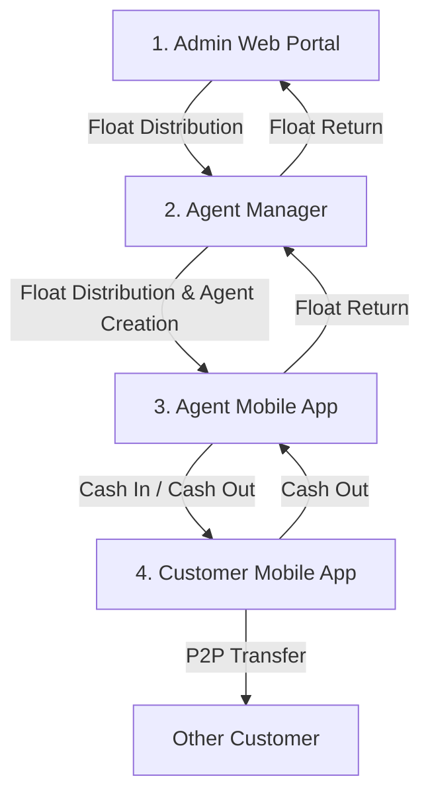

# Smart Wallet Management System Specification & Architecture Document (မြန်မာဘာသာ)

ဤစာရွက်စာတမ်းသည် **Smart Wallet Management System** ၏ စနစ်တစ်ခုလုံးဆိုင်ရာ လုပ်ဆောင်ချက်စီးဆင်းမှု (System Flow)၊ Role အလိုက် ပါဝင်သော Features များ နှင့် စနစ်စည်းမျဉ်းများ (System Rules & Transfer Matrix) ကို အသေးစိတ် ပြုစုထားသော တရားဝင် လမ်းညွှန်ဖြစ်ပါသည်။

---

## 1. စနစ်တစ်ခုလုံး၏ လုပ်ဆောင်ချက် စီးဆင်းမှု (Overall System Flow)

Smart Wallet Management System သည် Hierarchical Structure (အဆင့်ဆင့် စီမံခန့်ခွဲသည့်စနစ်) ပေါ်တွင် အခြေခံထားပြီး Role (၄) ခုဖြင့် လုပ်ဆောင်ပါသည်။

### 🔄 စနစ်၏ ပင်မ စီးဆင်းမှု (Core System Workflows):

1. **Authentication & Identity Flow (အကောင့်ဝင်ခြင်းနှင့် လုံခြုံရေး)**:
   - **Phone & OTP**: အသုံးပြုသူသည် ဖုန်းနံပါတ်ဖြင့် OTP တောင်းဆိုပြီး အတည်ပြုသည်။
   - **PIN Setup**: OTP အတည်ပြုပြီးနောက် ၄ လုံးပါ Security PIN သတ်မှတ်ရသည်။
   - **Sanctum Token Auth**: Authentication အောင်မြင်ပါက Bearer Token ထုတ်ပေးပြီး API Request တိုင်းကို လုံခြုံစွာ အသုံးပြုသည်။

2. **Money Transfer & Float Management Flow (ငွေလွှဲနှင့် ဘောနပ်စ်/ဖလုတ် စီမံခန့်ခွဲမှု)**:
   - **Top-Down Distribution**: Admin မှ Agent Manager ထံသို့၊ Agent Manager မှ Agent ထံသို့ Float (လုပ်ငန်းသုံးငွေ) ခွဲဝေပေးသည်။
   - **Retail Cash In/Out**: Agent မှ Customer ထံသို့ Deposit (Cash In) ပြုလုပ်ပေးပြီး Customer မှ Agent ထံမှ Cash Out ထုတ်ယူသည်။
   - **P2P Transfer**: Customer အချင်းချင်း QR Code (သို့) ဖုန်းနံပါတ်ဖြင့် တိုက်ရိုက် ငွေလွှဲပြောင်းနိုင်သည်။
   - **Bottom-Up Return**: Agent မှ Agent Manager ထံသို့၊ Agent Manager မှ Admin ထံသို့ Float ပြန်လည်အပ်နှံ (Float Return) နိုင်သည်။

3. **KYC & NRC Verification Flow (အထောက်အထား စစ်ဆေးရေး စီးဆင်းမှု)**:
   - **Customer Submission**: Customer သည် Profile မှတစ်ဆင့် NRC ရှေ့/နောက် ဓာတ်ပုံများကို တင်ပြသည်။
   - **Pending Status**: KYC Status သည် `pending` သို့ ပြောင်းလဲသွားသည်။
   - **Admin Approval**: Admin Web Dashboard မှ အထောက်အထားကို စစ်ဆေး၍ `verified` (အတည်ပြု) သို့မဟုတ် `rejected` (ငြင်းပယ် - အကြောင်းပြချက်ပါဝင်) ပြုလုပ်နိုင်သည်။

---

## 2. Role အလိုက် ပါဝင်သော Features များ (Each Role Features)

### 👑 1. Admin (Web Dashboard Portal)
System တစ်ခုလုံး၏ အချုပ်အခြာ စီမံခန့်ခွဲသူ ဖြစ်သည်။
- **Agent Manager Management**: Agent Manager သစ်များ ဖန်တီးခြင်း၊ တည်းဖြတ်ခြင်း၊ အကောင့် အပိတ်/အဖွင့် (Toggle Status) ပြုလုပ်ခြင်း။
- **System-wide Wallet Supervision**: Admin Wallet Balance ကြည့်ရှုခြင်း၊ Agent Manager များထံသို့ Float Transfer လုပ်ပေးခြင်း။
- **Customer KYC Verification**: Customer များ တင်ပြထားသော NRC Verification များအား စစ်ဆေး၍ Approved (Verified) / Rejected ပြုလုပ်ခြင်း။
- **Global Transaction & Audit History**: စနစ်တစ်ခုလုံးတွင် ဖြစ်ပွားသမျှ Transaction များအားလုံး၏ မှတ်တမ်းကို ရှာဖွေ/စစ်ဆေးခြင်း။
- **Location Master Data**: ပြည်နယ်/တိုင်း (State/Region) နှင့် မြို့နယ် (Township) Data များ စီမံခန့်ခွဲခြင်း။

### 💼 2. Agent Manager (Web Dashboard Portal / Agent Manager Service)
Agent များကို တိုက်ရိုက် ကူညီစီမံပေးသော ရိဂျင်နယ် စီမံခန့်ခွဲသူ ဖြစ်သည်။
- **Agent Creation & Management**: မိမိအောက်တွင် Agent သစ်များ စာရင်းသွင်းခြင်း၊ Agent Code (`AG-xxxxxx`) ထုတ်ပေးခြင်း၊ NRC Front/Back ပုံများ အလိုအလျောက် သတ်မှတ်ပေးခြင်း။
- **Float Supply**: မိမိ ဖလုတ်လက်ကျန်ထဲမှ Agent များထံသို့ Agent Float Distribution ပြုလုပ်ပေးခြင်း။
- **Float Return Management**: Agent များထံမှ ပြန်လည်အပ်နှံသော Float များကို လက်ခံခြင်းနှင့် Admin ထံသို့ ပြန်လည်အပ်နှံခြင်း။
- **Managed Agents Supervision**: မိမိ ဖန်တီးထားသော Agent များ၏ အရောင်းမှတ်တမ်းနှင့် Wallet Balance များကို စောင့်ကြည့်ခြင်း။

### 🏧 3. Agent (Agent Mobile App - iOS / Android)
ပြင်ပဆိုင်များတွင် Customer များကို တိုက်ရိုက် ဝန်ဆောင်မှုပေးသော ကိုယ်စားလှယ် ဖြစ်သည်။
- **Cash In Service**: Customer ၏ ဖုန်းနံပါတ် (သို့) QR Code ကို Scan ဖတ်၍ Customer Wallet ထံသို့ ငွေဖြည့်သွင်းပေးခြင်း။
- **Float Return**: မိမိ၏ တာဝန်ခံ Agent Manager ထံသို့ Float ပြန်လည်အပ်နှံခြင်း။
- **Dynamic QR Code**: မိမိ၏ Agent QR Code ကို ပြသ၍ Customer ထံမှ ငွေလက်ခံခြင်း။
- **Real-time Balance Polling & Alerts**: Balance ပြောင်းလဲမှုကို ၃ စက္ကန့်တိုင်း Auto-poll လုပ်၍ ငွေဝင်ပါက Instant Notification Bell & Toast ပြသခြင်း။
- **Security PIN Integration**: Cash In မပြုလုပ်မီ ၄ လုံးပါ Security PIN အမြဲ စစ်ဆေးခြင်း။

### 📱 4. Customer (Customer Mobile App - iOS / Android)
စနစ်၏ အဆုံးသတ် သုံးစွဲသူ ဖြစ်သည်။
- **Send Money / P2P Transfer**: အခြား Customer များထံသို့ ဖုန်းနံပါတ် (သို့) QR Code ဖြင့် တိုက်ရိုက် ငွေလွှဲခြင်း။
- **Cash Out to Agent**: Agent ထံတွင် ငွေထုတ်ယူခြင်း။
- **NRC / KYC Verification Upload**: App Profile မျက်နှာပြင်မှ NRC ရှေ့/နောက် ဓာတ်ပုံများ ရွေးချယ်၍ KYC လျှောက်ထားခြင်း။
- **My QR Code**: မိမိ၏ ကိုယ်ပိုင် QR Code ကို ပြသ၍ ငွေလက်ခံခြင်း။
- **Transaction Receipt Modal**: ငွေလွှဲပြီးတိုင်း တရားဝင် ပြေစာ (Receipt) ကြည့်ရှုနိုင်ခြင်း၊ အလိုအလျောက် သိမ်းဆည်းခြင်း။
- **Profile & PIN Management**: Security PIN ပြောင်းလဲခြင်း၊ Profile Image ပြောင်းလဲခြင်း။

---

## 3. စနစ် စည်းမျဉ်းများနှင့် ကန့်သတ်ချက်များ (System Rules & Transfer Matrix)

### 💸 (A) Money Transfer Permission Matrix (ငွေလွှဲ ခွင့်ပြုချက် စည်းမျဉ်းများ)

စနစ်၏ လုံခြုံရေးနှင့် Hierarchy လွဲမှားမှု မရှိစေရန် အောက်ပါ Matrix အတိုင်းသာ ငွေလွှဲခွင့်ပြုထားသည်:

| Sender (ငွေပို့သူ) | Receiver (ငွေလက်ခံသူ) | Allowed Transaction Type | စည်းမျဉ်း သတ်မှတ်ချက် |
| :--- | :--- | :--- | :--- |
| **Admin** | Agent Manager | `admin_to_agent_manager` | Admin မှ Manager ထံ Float ခွဲဝေခြင်းသာ ရမည် |
| **Agent Manager** | Agent | `manager_to_agent` | Manager မှ မိမိ Agent ထံ Float ပေးခြင်း |
| **Agent Manager** | Admin | `manager_to_admin` | Manager မှ Admin ထံ Float ပြန်အပ်ခြင်း |
| **Agent** | Customer | `agent_to_customer` | Agent မှ Customer ထံ Cash In (Deposit) ပြုလုပ်ခြင်း |
| **Agent** | Agent Manager | `agent_to_agent_manager` | Agent မှ မိမိအား ဖန်တီးခဲ့သော Manager ထံသာ Float ပြန်အပ်နိုင်သည် |
| **Customer** | Customer | `customer_to_customer` | Customer အချင်းချင်း P2P Money Transfer ပြုလုပ်ခြင်း |
| **Customer** | Agent | `customer_to_agent` | Customer မှ Agent ထံ Cash Out ပြုလုပ်ခြင်း |

> ❌ **တားမြစ်ထားသော လွှဲပြောင်းမှုများ (Disallowed Transfers)**:
> - `Admin` ↔ `Customer` (တိုက်ရိုက် လွှဲပြောင်းခွင့် မရှိပါ)
> - `Admin` ↔ `Agent` (တိုက်ရိုက် လွှဲပြောင်းခွင့် မရှိပါ)
> - `Agent Manager` ↔ `Customer` (တိုက်ရိုက် လွှဲပြောင်းခွင့် မရှိပါ)

---

### 🛡️ (B) Security & Authentication Rules (လုံခြုံရေး စည်းမျဉ်းများ)

1. **Wallet Active Requirement**:
   - Sender နှင့် Receiver နှစ်ဦးစလုံး၏ User Status သည် `active` ဖြစ်ရမည်။ (`inactive` သို့မဟုတ် `suspended` အကောင့်များ ငွေလွှဲ/ငွေလက်ခံ ပြုလုပ်၍ မရပါ)။
   - Sender Wallet နှင့် Receiver Wallet နှစ်ခုလုံး Status သည် `active` ဖြစ်ရမည်။
2. **PIN Verification**:
   - ငွေလွှဲပြောင်းမှု တိုင်း (Transfer API All Endpoints) တွင် ၄ လုံးပါ PIN ကို Bcrypt Hash ဖြင့် စစ်ဆေးပြီး မှန်ကန်မှသာ Transaction ကို Execute လုပ်သည်။
3. **Immutability of Identifiers**:
   - NRC Number နှင့် User Role တို့ကို အကောင့်တည်ဆောက်ပြီးပါက တိုက်ရိုက် ပြောင်းလဲခွင့် မရှိပါ။
4. **Multipart File Upload Handling**:
   - Image Upload (Profile Image, NRC Front/Back) များကို `multipart/form-data` ဖြင့်သာ လက်ခံပြီး Server Public Storage တွင် လုံခြုံစွာ သိမ်းဆည်းသည်။

---

### 📄 (C) Transaction Receipt & Notification Rules

1. **Unique Transaction Number**:
   - Transaction တိုင်းအတွက် `TXN-xxxxxxxx` ပုံစံဖြင့် ထူးခြားသော နံပါတ် အလိုအလျောက် ထွက်ရှိသည်။
2. **Notification Syncing**:
   - Money Received (ငွေလက်ခံရရှိမှု) ဖြစ်ပေါ်ပါက Mobile App ၏ AsyncStorage / SecureStore တွင် Notification Record သိမ်းဆည်းပြီး Unread Badge & Sound/Toast အချက်ပြပေးသည်။
