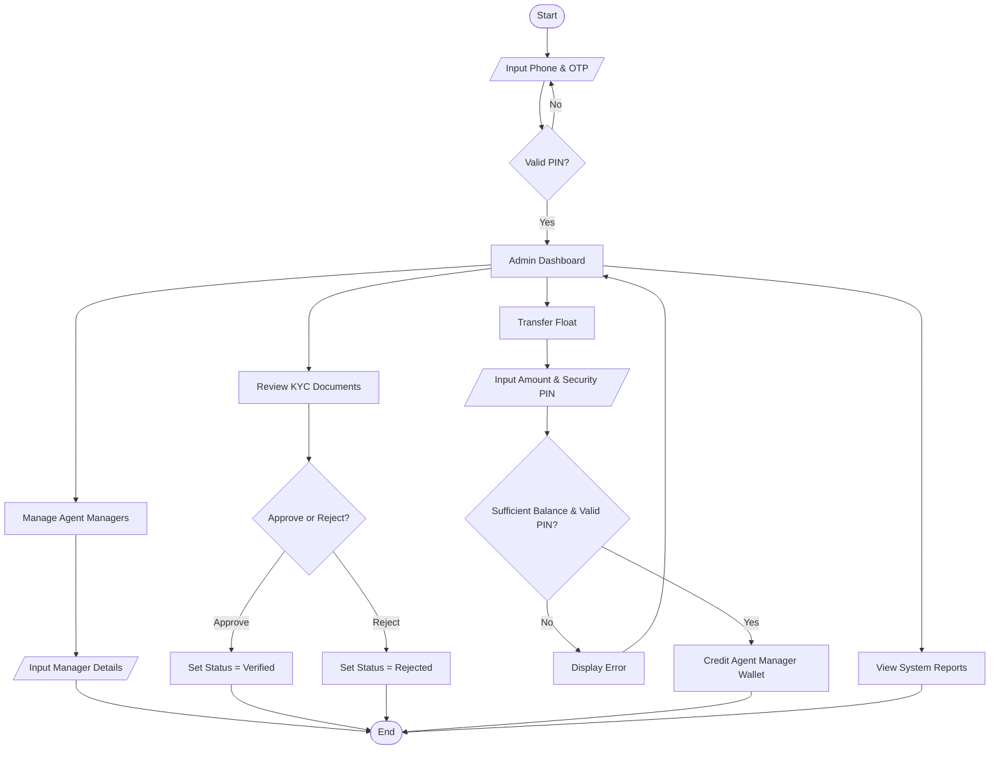
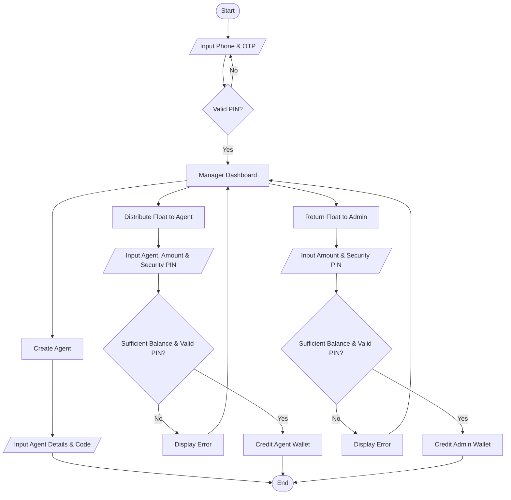
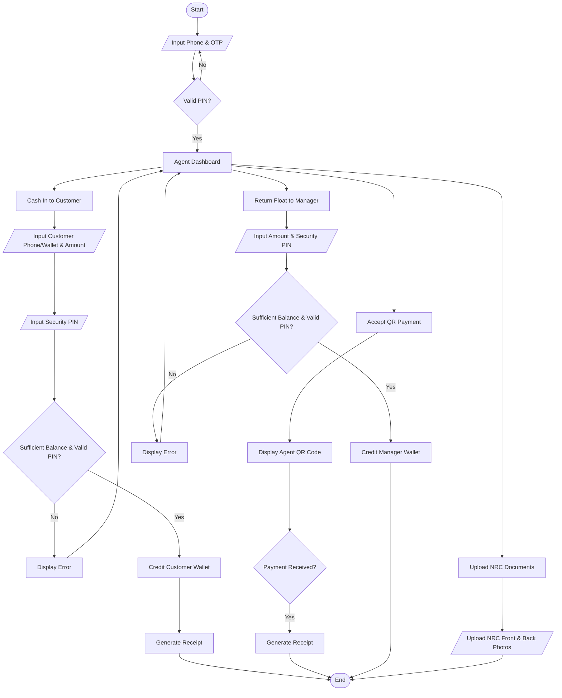
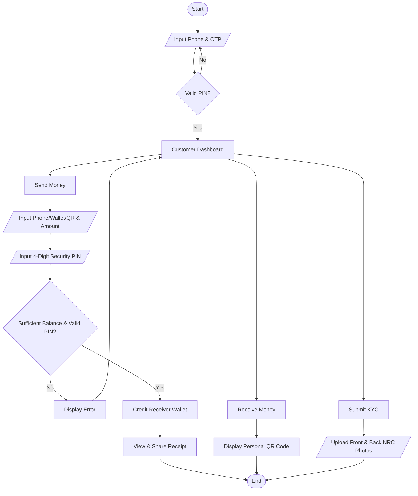

# System & Role Flowcharts (with Inputs & Conditionals)

This document presents clear, standard **Flowcharts** for each role in the **Digital Wallet Management System (DWMS)**, including explicit user inputs `[/Input/]` and decision points `{Conditional?}`.

---

## 1. Overall Money & Float Flow

```mermaid
flowchart TD
    Admin["Admin (System Treasury)"]
    Manager["Agent Manager"]
    Agent["Agent"]
    Customer["Customer"]

    %% Distribution
    Admin -->|"1. Distribute Float"| Manager
    Manager -->|"2. Distribute Float"| Agent
    Agent -->|"3. Cash In"| Customer

    %% Return
    Agent -.->"4. Return Float"| Manager
    Manager -.->"5. Return Float"| Admin

    %% Transfers
    Customer <-->|"P2P Money Transfer"| Customer
    Customer ==>|"QR Payment"| Agent
```

---

## 2. Admin Flowchart



---

## 3. Agent Manager Flowchart



---

## 4. Agent Flowchart



---

## 5. Customer Flowchart


