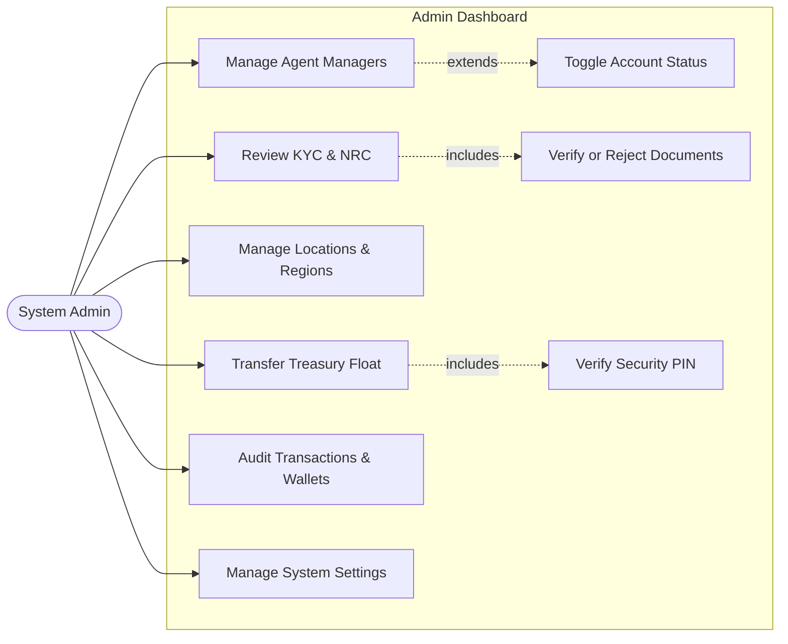
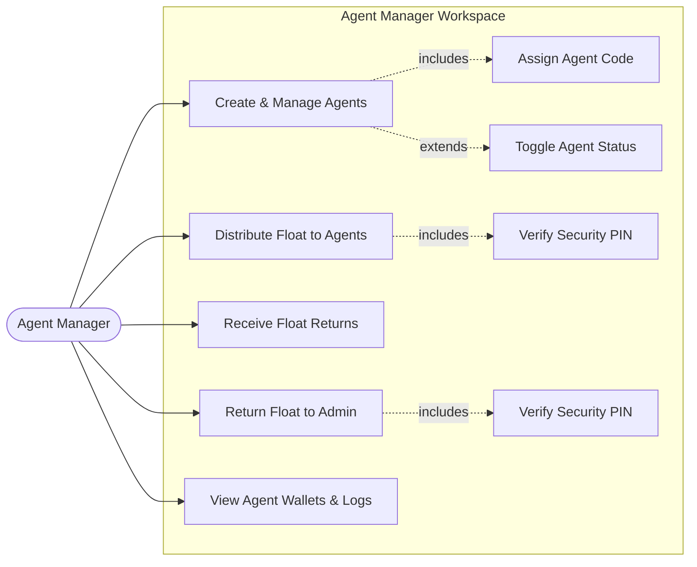
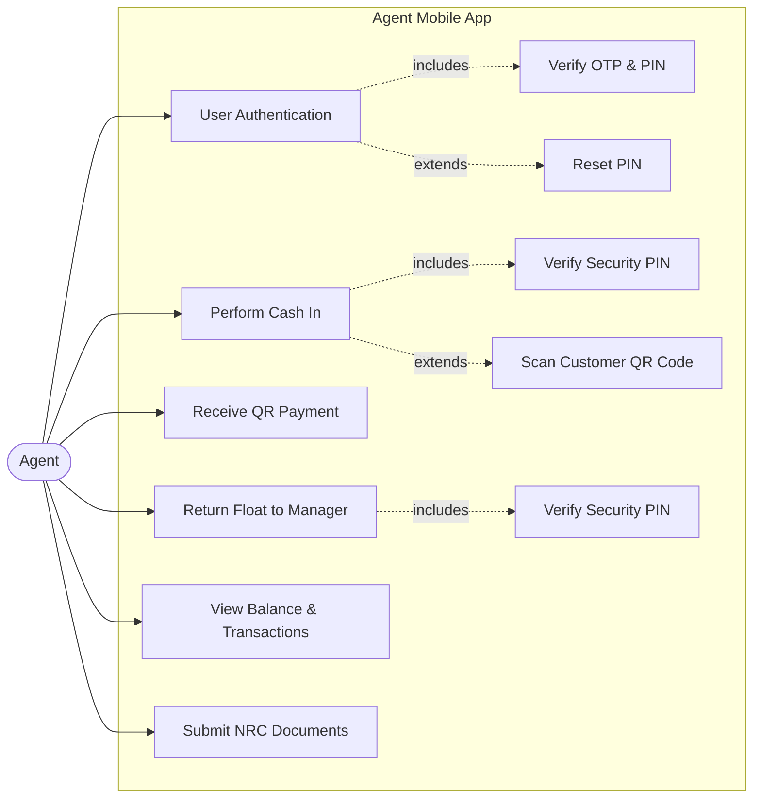
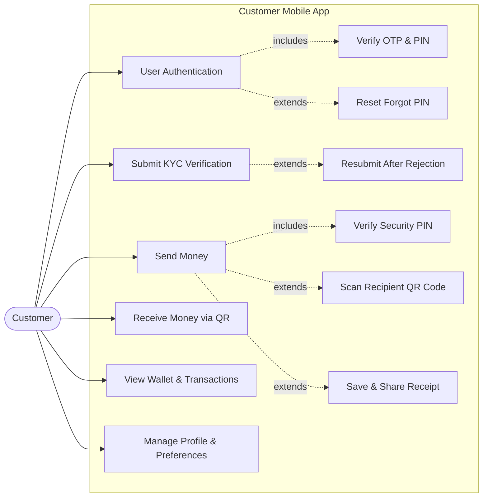

# Simplified System Use Case Diagrams (with Includes & Extends)

This document presents concise, high-level **Use Case Diagrams** for each role in the **Digital Wallet Management System (DWMS)**, highlighting key functional relationships using standard UML `<<include>>` and `<<extend>>` dependencies.

---

## 1. Admin Use Case Diagram

---

## 2. Agent Manager Use Case Diagram

---

## 3. Agent Use Case Diagram

---

## 4. Customer Use Case Diagram

