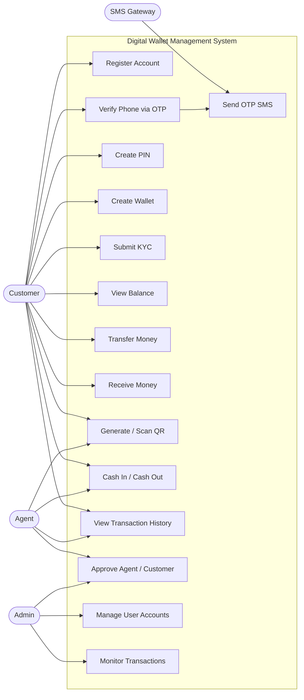

# Digital Wallet Management System - Use Case Diagram

This file contains a Mermaid-based use case diagram for the digital wallet management system.

## Actors
- Customer
- Agent
- Admin
- SMS Gateway

## Main Use Cases
- Register account
- Verify phone with OTP
- Create PIN
- Create wallet
- Submit KYC
- View balance
- Transfer money
- Receive money
- Generate/scan QR payment
- Cash in / cash out
- View transaction history
- Approve agent/customer requests
- Manage users and accounts
- Send OTP SMS

## Mermaid Diagram

## Notes
This diagram is suitable for documentation, presentations, and Draw.io/Mermaid-based viewers.
